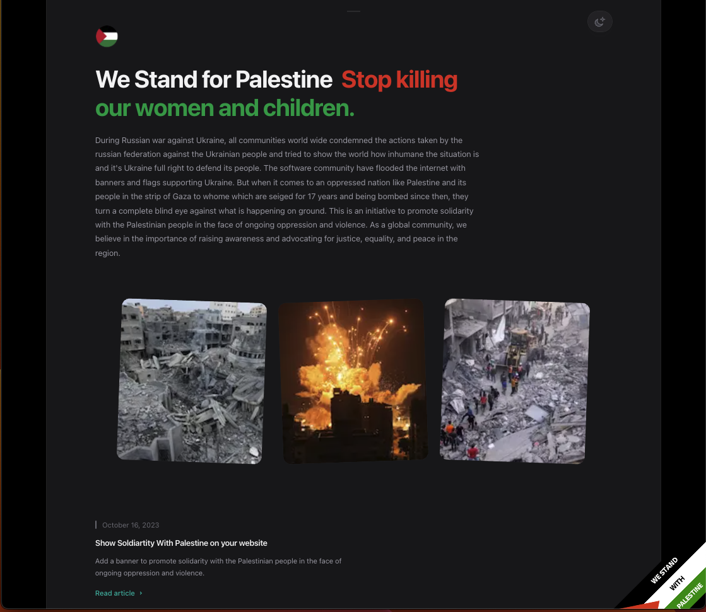

<div id="top"></div>
<br />
<div align="center">
  <a href="https://www.standwithpalestine.dev">
    
  </a>

  <h3 align="center">🇵🇸 Stand With Palestine 🇵🇸</h3>

  <p align="center">
    Add this widget to your website to show support for Palestine
    <br />
    <a href="#getting-started"><strong>Explore the docs »</strong></a>
    <br />
    <br />
    <a href="https://www.standwithpalestine.dev">View Demo</a>
    ·
    <a href="https://github.com/jafar-albadarneh/stand-with-palestine/issues/new">Report Bug</a>
    ·
    <a href="https://github.com/jafar-albadarneh/stand-with-palestine/issues/new">Request Feature</a>
  </p>
</div>

<details>
  <summary>Table of Contents</summary>
  <ol>
    <li>
      <a href="#about-the-project">About The Project</a>
    </li>
    <li>
      <a href="#getting-started">Getting Started</a>
      <ul>
        <li><a href="#prerequisites">Prerequisites</a></li>
      </ul>
      <ul>
        <li><a href="#installation">Installation</a></li>
      </ul>
    </li>
    <li><a href="#license">License</a></li>
    <li><a href="#contact">Contact</a></li>
  </ol>
</details>

## About The Project

<div align="center">
  <a href="https://www.standwithpalestine.dev">
    
  </a>
</div>

<br/>

The "Stand-With-Palestine" repository is a simple yet powerful initiative to promote solidarity with the Palestinian people in the face of ongoing oppression and violence. As a global community, we believe in the importance of raising awareness and advocating for justice, equality, and peace in the region.

### Why "Stand-With-Palestine"?
The situation in Palestine has been marked by conflict and suffering for decades, and was lately translated into a genocide where thousands of Palestinians women and children were slaughtered in cold-blood by the Israeli airstikes on the strip of Gaza.

This repository serves as a resource hub for individuals and organizations who want to stand in solidarity with the Palestinian people and contribute to the global conversation about their rights, dignity, and freedom.

### Key Features
- **Website Banner:** Our primary offering is a customizable website banner that can be easily integrated into any web platform. This banner will help you show your support for Palestine by spreading awareness and encouraging dialogue on the issues faced by the Palestinian population.

- **Information Resources:** Access a curated collection of articles, videos, and infographics that shed light on the history, current challenges, and potential solutions to the Israeli-Palestinian conflict.


<p align="right">(<a href="#top">back to top</a>)</p>

## Getting Started

Follow the steps below to add this widget to your website, or page of your choosing.
Keep in mind, the tag needs to be added to each page you would like the widget to appear on.

### Prerequisites

To use this widget, the only prerequisites needed is `.html` file(s), or other file extensions with syntax similar to html.

### Installation

_Below is an example of how you can install this widget on your website. The widget doesn't rely on any external dependencies or services._

1. Grab the most updated CDN link at [https://www.standwithpalestine.dev/#widget](https://www.standwithpalestine.dev/)
2. Find the page(s) you would like this widget on
3. Paste this (replace CDN version if different than posted)

   ```html
   <!-- Support for Palestine widget -->
   <div id="palestine"></div>

   <script src="https://cdn.jsdelivr.net/gh/jafar-albadarneh/stand-with-palestine@main/src/script.v1.1.js"></script>
   <!-- end widget tag -->
   ```

4. Push your code to production and test the widget 🇵🇸

<p align="right">(<a href="#top">back to top</a>)</p>

## License

Distributed under the GNU GPLv3 License. See `LICENSE.txt` or https://choosealicense.com/licenses/gpl-3.0/ for more information.
Available for open-source, making available complete source code of licensed works and modifications, under the same license. <br/><b>Copyright and license notices must be preserved</b>

<!-- <p align="right">(<a href="#top">back to top</a>)</p> -->

## Contact

Jafar Albadarneh - jafar.albadarneh@gmail.com

<p align="right">(<a href="#top">back to top</a>)</p>
